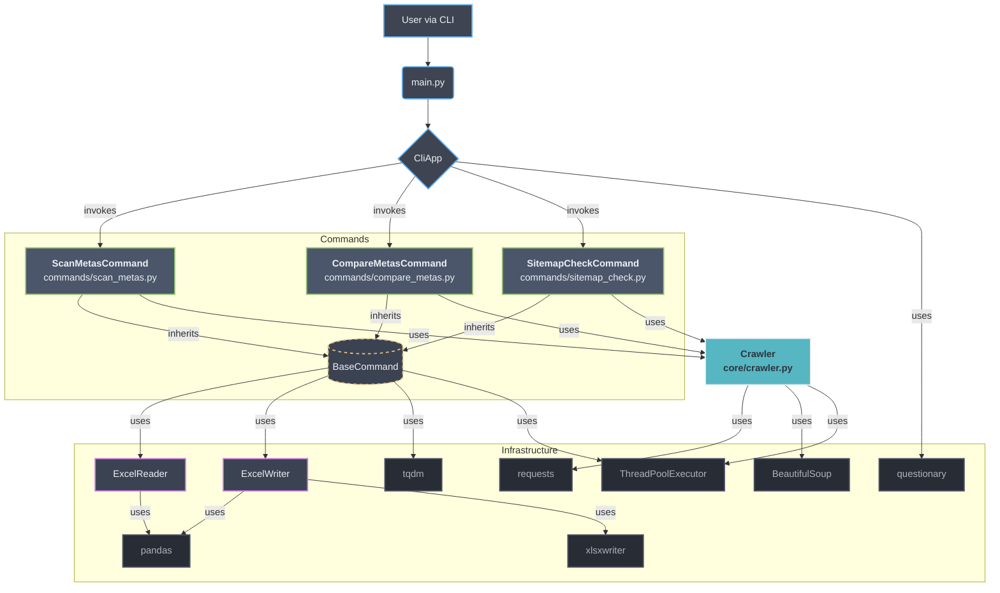

# 🤖 SEO Helper


**Uma ferramenta de linha de comando (CLI) de alto desempenho para automatizar auditorias técnicas de SEO.**

---

_[Leia em Inglês / Read in English](README.md)_

---

## O Problema

Durante minha experiência como estagiário em Desenvolvimento Full Stack na Conversion, deparei-me com uma série de tarefas de SEO que, embora cruciais, eram extremamente repetitivas. Implementar e, principalmente, verificar alterações em centenas de páginas era um desafio constante.

As demandas eram variadas:

- Garantir a presença da tag essencial `<meta name="robots">` para a correta indexação.

- Auditar se o conteúdo de dezenas de `<meta name="description">` ou outras tags havia sido atualizado corretamente conforme o planejado.

O gargalo era sempre o mesmo: a verificação manual. O processo era desanimador, lento e propenso a erros:

1.  Abrir a página num navegador.
2.  Pressionar `Ctrl+U` para ver o código-fonte.
3.  Procurar no HTML por uma única linha de código ou um texto específico.

Com a identificação desses processos manuais, decidi criar o SEO Helper: um assistente de linha de comando para automatizar essas verificações e otimizar meu fluxo de trabalho. O que começou como um script para resolver um problema pontual evoluiu para uma ferramenta de CLI (Command-Line Interface) robusta e escalável, uma oportunidade de aplicar e aprofundar conceitos avançados de engenharia de software para resolver desafios reais. A arquitetura foi migrada para um design totalmente orientado a objetos, baseado no Command Pattern, onde cada funcionalidade é um componente autônomo e desacoplado. Isso torna a aplicação facilmente extensível — novos comandos podem ser adicionados sem qualquer alteração no núcleo do sistema. Para garantir a performance, foi implementado um motor de concorrência genérico e reutilizável, que orquestra tarefas em paralelo com um feedback claro ao utilizador através de uma interface interativa e guiada.

## A Solução

Para combater a ineficiência dos processos manuais, o SEO Helper foi concebido como uma plataforma de automação via linha de comando. A ferramenta ataca diretamente as dores apresentadas, transformando horas de trabalho repetitivo em segundos de execução de um comando.

A solução foi desenvolvida de forma modular, com cada comando sendo uma resposta direta a um dos desafios de SEO identificados:

1. Para a verificação de existência de tags: Foi criado o comando `scan-metas`. Com ele, é possível varrer milhares de URLs e confirmar a presença (ou ausência) de qualquer tag HTML, como a crucial `<meta name="robots">`.

2. Para a auditoria de conteúdo: Foi implementado o comando `compare-metas`. Ele automatiza a validação do conteúdo de meta tags, como `<title>` ou `<meta name="description">`, comparando o valor atual com um texto esperado e reportando as divergências.

O verdadeiro poder do SEO Helper, no entanto, está em sua arquitetura. Em vez de criar scripts isolados, optei por um design escalável baseado no Command Pattern. Isso significa que a aplicação está pronta para crescer: novas ferramentas de verificação podem ser adicionadas como novos "comandos" sem alterar a base do sistema, consolidando o SEO Helper como uma suíte de SEO progressivamente mais poderosa.

## Principais Funcionalidades

A arquitetura desta ferramenta utiliza um conjunto de bibliotecas poderosas para alcançar um alto grau de desempenho e robustez.

- **Arquitetura Escalável com Command Pattern:** O núcleo da aplicação utiliza o Command Pattern. Cada funcionalidade (`scan-metas`, `compare-metas`) é um objeto de comando desacoplado, registrado dinamicamente. Isso torna o sistema modular e fácil de estender: novos comandos podem ser adicionados sem alterar o código existente.
- **Motor de Concorrência Genérico e Reutilizável:** A lógica de processamento paralelo com `ThreadPoolExecutor` e a barra de progresso visual (`tqdm`) foram abstraídas para uma classe base (`BaseCommand`). Qualquer novo comando herda automaticamente alta performance e feedback em tempo real para o usuário, promovendo a reutilização de código (DRY - Don't Repeat Yourself).
- **Interface de Usuário Amigável e Guiada:** Para uma melhor experiência (UX), a ferramenta oferece um modo interativo (`questionary`) que guia o usuário passo a passo. Para operações diretas, uma barra de progresso (`tqdm`) informa o status em tempo real, combinando acessibilidade com feedback claro.
- **Rede Otimizada e Eficiente:** Para minimizar a latência e o overhead de conexões, a aplicação utiliza um único objeto `requests.Session` que é compartilhado entre todas as threads. Isso permite a reutilização de conexões TCP (keep-alive), melhorando significativamente a performance em varreduras de grande volume.
- **Tratamento de Erros Robusto e Logging:** A aplicação foi construída com resiliência em mente. Falhas de rede ou erros de parsing em uma URL são capturados individualmente através de blocos `try...except`, registrados em um arquivo de log (`app.log`) para depuração, e não interrompem o processamento das demais URLs, garantindo que a tarefa seja concluída.

## Arquitetura

Aqui está uma visão de alto nível da arquitetura da aplicação, ilustrando a separação de responsabilidades entre as diferentes camadas.



## Demonstração

Aqui está um exemplo do relatório final gerado pelo script:


## Instalação e Uso

Siga os passos abaixo para configurar e executar o projeto em sua máquina local.

**1. Pré-requisitos**

- Python 3.10 ou superior

**2. Configuração do Ambiente**

```bash
# 1. Clone o repositório
git clone [https://github.com/armandomonteir-o/script-meta-robots-finder.git](https://github.com/armandomonteir-o/script-meta-robots-finder.git)
cd script-meta-robots-finder

# 2. Crie e ative um ambiente virtual (altamente recomendado)
python -m venv .venv
source .venv/bin/activate  # No Windows, use: .venv\Scripts\activate

# 3. Instale as dependências necessárias
pip install -r requirements.txt
```

**3. Como Executar**
A ferramenta foi projetada para ser flexível, oferecendo três modos de execução:

---

**Modo 1: Interativo (Recomendado para o primeiro uso)**
Este modo é a forma mais fácil de usar a ferramenta. Ele apresenta um menu que guia você na escolha do comando e solicita cada um dos parâmetros necessários, passo a passo. É ideal para quem não quer se preocupar em decorar os argumentos de linha de comando

```bash
python main.py
```

---

**Modo 2: Direto com `scan-metas`**
Use este comando quando quiser verificar rapidamente a presença de uma ou mais meta tags em uma lista de URLs. Ele requer dois argumentos posicionais: o caminho para o arquivo e o nome da coluna das URLs.

- Uso:

  ```bash
  python main.py scan-metas <caminho_do_arquivo.xlsx> "<nome_da_coluna>"
  ```

- Exemplo prático:

```bash
# Verifica a existência da tag <meta name="robots"> (padrão) no arquivo de exemplo
python main.py scan-metas "samples/sample_urls.xlsx" "URL"
```

- Exemplo com múltiplos checks:

```bash
# Verifica a existência das tags "robots" e "viewport"
python main.py scan-metas "samples/sample_urls.xlsx" "URL" --checks robots viewport
```

---

**Modo 3: Direto com `compare-metas`**
Use este comando para auditar o conteúdo de diferentes meta tags contra valores esperados. Ele espera um arquivo `.xlsx` que contenha colunas para a URL, o nome da meta tag e o conteúdo esperado.

- Uso:

```bash
python main.py compare-metas <caminho_do_arquivo_de_auditoria.xlsx>
```

- Exemplo prático:
  **Nota**: Para este comando funcionar, seu arquivo auditoria.xlsx deve ter colunas nomeadas "URL", "Meta Name" e "Expected Content" (ou você pode especificar outros nomes usando as flags --url-col, --name-col, --content-col).

  ```bash
  # Executa a auditoria com base no arquivo 'auditoria.xlsx'
  python main.py compare-metas "caminho/para/sua/auditoria.xlsx"
  ```

## Tecnologias Utilizadas

A seleção de tecnologias para este projeto foi focada em performance, robustez e uma excelente experiência de usuário.

- **Python 3.10+:** A linguagem principal, escolhida por seu ecossistema maduro e clareza. O uso de type hints foi priorizado para garantir um código mais seguro e de fácil manutenção.
- **Questionary:** Biblioteca fundamental para a criação da interface interativa. Permite construir prompts e menus complexos no terminal de forma simples e intuitiva, tornando a ferramenta acessível a todos.
- **Requests & Beautiful Soup:** A dupla padrão da indústria para web scraping. `Requests` (com `requests.Session`) gerencia as conexões de rede de forma eficiente, enquanto `Beautiful Soup` faz o parsing do HTML mais complexo com facilidade e resiliência.
- **Pandas & XlsxWriter:** Utilizados para a manipulação dos dados em memória e para a geração dos relatórios finais. `XlsxWriter` permite a criação de planilhas `.xlsx` com formatação profissional, como cores condicionais e filtros automáticos.
- **Tqdm:** Essencial para a experiência do usuário em uma CLI. Fornece uma barra de progresso clara e em tempo real, dando feedback visual sobre o andamento de tarefas que podem levar mais tempo.

## Licença

Este projeto está licenciado sob a Licença MIT. Veja o arquivo [LICENSE](LICENSE) para mais detalhes.

## Contribuidor

Um projeto idealizado e desenvolvido por Armando Monteiro.

<a href="https://github.com/armandomonteir-o">
  
</a>

---
