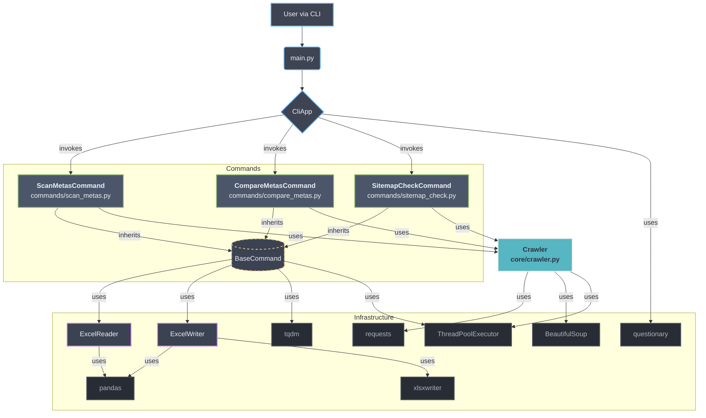

# 🤖 SEO Helper


**A high-performance command-line (CLI) tool for automating technical SEO audits.**

---

_[Read this in Portuguese / Leia em Português](README-PT.md)_

---

## The Problem

During my experience as a Full Stack Developer Intern at Conversion, I faced a series of SEO tasks that, while crucial, were extremely repetitive. Implementing and, more importantly, verifying changes across hundreds of pages was a constant challenge.

The demands were varied:

- Ensuring the presence of the essential `<meta name="robots">` tag for correct indexing.
- Auditing whether the content of dozens of `<meta name="description">` tags or others had been correctly updated as planned.
- Verifying that all important URLs were properly listed in the XML sitemaps for search engine crawling.

The bottleneck was always the same: manual verification. The process was daunting, slow, and prone to errors:

1.  Open a page in the browser.
2.  Press `Ctrl+U` to view the source code.
3.  Search the HTML for a single line of code or a specific text.

By identifying these manual processes, I decided to create **SEO Helper**: a command-line assistant to automate these checks and optimize my workflow. What began as a script to solve a specific problem evolved into a robust and scalable CLI (Command-Line Interface) tool—an opportunity to apply and deepen advanced software engineering concepts to solve real-world challenges. The architecture was migrated to a fully object-oriented design based on the **Command Pattern**, where each feature is an autonomous and decoupled component. This makes the application easily extensible—new commands can be added without any changes to the core system. To ensure performance, a generic and reusable concurrency engine was implemented, orchestrating parallel tasks with clear user feedback through an interactive and guided interface.

## The Solution

To combat the inefficiency of manual processes, **SEO Helper** was designed as a **command-line automation platform**. The tool directly addresses the identified pain points, turning hours of repetitive work into seconds of command execution.

The solution was developed in a modular way, with each command being a direct answer to one of the identified SEO challenges:

1.  **For checking tag existence**: The `scan-metas` command was created. It can crawl thousands of URLs and confirm the presence (or absence) of any HTML tag, such as the crucial `<meta name="robots">`.

2.  **For auditing content**: The `compare-metas` command was implemented. It automates the validation of meta tag content, like `<title>` or `<meta name="description">`, by comparing the current value against an expected text and reporting any discrepancies.

3.  **For sitemap verification**: The `sitemap-check` command was introduced. It validates that all critical URLs are properly included in XML sitemaps, ensuring proper search engine crawling coverage.

The true power of SEO Helper, however, lies in its architecture. Instead of creating isolated scripts, I opted for a scalable design based on the **Command Pattern**. This means the application is ready to grow: new verification tools can be added as new "commands" without altering the system's core, establishing SEO Helper as an increasingly powerful SEO suite.

## Key Features

- **Scalable Architecture with Command Pattern:** The application's core uses the Command Pattern. Each feature (`scan-metas`, `compare-metas`, `sitemap-check`) is a decoupled, dynamically registered command object. This makes the system modular and easy to extend: new commands can be added without altering the existing code.
- **Generic and Reusable Concurrency Engine:** The parallel processing logic with `ThreadPoolExecutor` and the visual progress bar (`tqdm`) were abstracted into a base class (`BaseCommand`). Any new command automatically inherits high performance and real-time user feedback, promoting code reuse (DRY - Don't Repeat Yourself).
- **User-Friendly and Guided Interface:** For a better user experience (UX), the tool offers an interactive mode (`questionary`) that guides the user step-by-step. For direct operations, a progress bar (`tqdm`) provides real-time status, combining accessibility with clear feedback.
- **Optimized and Efficient Networking:** To minimize latency and connection overhead, the application uses a single `requests.Session` object shared across all threads. This allows for TCP connection reuse (keep-alive), significantly improving performance on large-volume scans.
- **Robust Error Handling and Logging:** The application was built with resilience in mind. Network failures or parsing errors on a single URL are caught individually via `try...except` blocks, logged to a file (`app.log`) for debugging, and do not interrupt the processing of other URLs, ensuring the task completes.
- **Comprehensive Test Coverage:** The codebase maintains a high test coverage (91%) through extensive unit and integration tests, ensuring reliability and making it easier to add new features with confidence.

## Architecture

Here is a high-level overview of the application's architecture, illustrating the separation of concerns between the different layers.



## Demo

Here is an example of the final report generated by the script:


## Installation and Usage

Follow the steps below to set up and run the project on your local machine.

**1. Prerequisites**

- Python 3.10 or higher

**2. Environment Setup**

```bash
# 1. Clone the repository
git clone [https://github.com/armandomonteir-o/script-meta-robots-finder.git](https://github.com/armandomonteir-o/script-meta-robots-finder.git)
cd script-meta-robots-finder

# 2. Create and activate a virtual environment (highly recommended)
python -m venv .venv
source .venv/bin/activate  # On Windows, use: .venv\Scripts\activate

# 3. Install the required dependencies
pip install -r requirements.txt
```

**3. How to Run**
The tool is designed to be flexible, offering three execution modes:

---

**Mode 1: Interactive (Recommended for first-time use)**

This mode is the easiest way to use the tool. It presents a menu that guides you through choosing a command and prompts for each necessary parameter, step-by-step. It's ideal for those who don't want to worry about memorizing command-line arguments.

```bash
python main.py
```

---

**Mode 2: Direct with `scan-metas`**
Use this command when you want to quickly check for the presence of one or more meta tags in a list of URLs. It requires two positional arguments: the file path and the name of the URL column.

- Usage:

```bash
python main.py scan-metas <path_to_file.xlsx> "<column_name>"
```

- Practical Example:

```bash
# Checks for the default <meta name="robots"> tag in the sample file
python main.py scan-metas "samples/sample_urls.xlsx" "URL"
```

- Example with multiple checks:

```bash
# Checks for the existence of both "robots" and "viewport" tags
python main.py scan-metas "samples/sample_urls.xlsx" "URL" --checks robots viewport
```

---

**Mode 3: Direct with `compare-metas`**

Use this command to audit the content of different meta tags against expected values. It expects an `.xlsx` file containing columns for the URL, the meta tag name, and the expected content.

- Usage:

```bash
python main.py compare-metas <path_to_audit_file.xlsx>
```

- Practical Example:

```bash
# Runs the audit based on the 'audit.xlsx' file
python main.py compare-metas "path/to/your/audit.xlsx"
```

**Note:** For this command to work, your audit file must have columns named "URL", "Meta Name", and "Expected Content" (or you can specify other names using the --url-col, --name-col, and --content-col flags).

---

**Mode 4: Direct with `sitemap-check`**

Use this command to verify that important URLs are properly listed in XML sitemaps. It compares a list of expected URLs against the actual contents of XML sitemaps.

- Usage:

```bash
python main.py sitemap-check <path_to_file.xlsx> [--sitemap-col SITEMAP_COL] [--urls-col URLS_COL]
```

- Practical Example:

```bash
# Verify URLs using default column names
python main.py sitemap-check "samples/sample_urls_sitemap.xlsx"

# Specify custom column names
python main.py sitemap-check "samples/sample_urls_sitemap.xlsx" --sitemap-col "Sitemap URL" --urls-col "Expected URLs"
```

**Note:** The input file should contain two columns:

- A column for sitemap URLs (default name: "Sitemap")
- A column for the URLs to verify (default name: "Expected URLs")

## Tech Stack

The technology selection for this project focused on performance, robustness, and an excellent user experience.

- **Python 3.10+**: The core language, chosen for its mature ecosystem and clarity. Type hints were prioritized to ensure safer and more maintainable code.
- **Questionary**: A key library for creating the interactive interface. It allows for building complex prompts and menus in the terminal simply and intuitively, making the tool accessible to everyone.
- **Requests & Beautiful Soup**: The industry-standard duo for web scraping. `Requests` (with `requests.Session`) efficiently manages network connections, while `Beautiful Soup` parses even complex HTML with ease and resilience.
- **Pandas & XlsxWriter**: Used for in-memory data manipulation and for generating the final reports. `XlsxWriter` enables the creation of professionally formatted `.xlsx` spreadsheets with features like conditional coloring and auto-filters.
- **Tqdm:** Essential for the user experience in a CLI. It provides a clear, real-time progress bar, giving visual feedback on the status of long-running tasks.
- **lxml**: A high-performance XML parser used for processing sitemaps efficiently and reliably.
- **pytest & pytest-cov**: Industry-standard testing framework with coverage reporting, enabling comprehensive test suites and quality metrics.

## License

This project is licensed under the MIT License. See the [LICENSE](LICENSE) file for details.

## Contributor

A project conceived and developed by Armando Monteiro.

<a href="https://github.com/armandomonteir-o">
  
</a>

---
