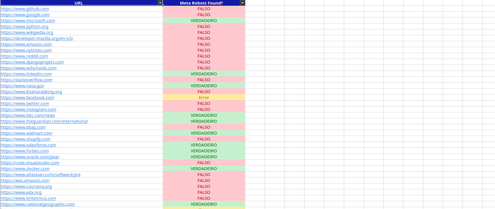

# 🤖 Meta Robots Finder


**A high-performance Python script to automate the process of finding the meta robots tag in a large list of URLs.**

---

_[Read this in Portuguese / Leia em Português](README-PT.md)_

---

## The Problem

In the world of technical SEO, ensuring that hundreds of client web pages are correctly indexed by search engines is a critical but often tedious task. I was faced with this exact challenge: a large number of URLs were missing the essential `<meta name="robots">` tag, jeopardizing their visibility on Google.

The manual solution was soul-crushing. It involved a repetitive cycle for each URL:

1.  Open the page in a browser.
2.  Press `Ctrl+U` to view the source code.
3.  Scan through the HTML to find a single, missing line of code.

What started as a simple script to automate a boring task quickly evolved into a complete project, a chance to not only solve a real-world problem but to do it efficiently and elegantly by applying advanced programming concepts.

## The Solution

**Meta Robots Finder** is a command-line tool that automates the tedious task of verifying the presence of the `<meta name="robots">` tag across hundreds or thousands of URLs.

The script reads a list of URLs from an Excel file, concurrently checks each one for the tag, and generates a clean, professionally formatted spreadsheet with the results, indicating `TRUE`, `FALSE`, or `Error` for each URL.

## Key Features

The architecture of this tool leverages a suite of powerful libraries to achieve a high degree of performance and robustness.

- **Object-Oriented Architecture:** The entire application is built using an OOP structure, separating concerns into `SpreadsheetManager` and `Crawler` classes.
- **High-Performance Concurrency:** Leverages a `ThreadPoolExecutor` to check multiple URLs in parallel, drastically reducing execution time.
- **Professional & Beautiful Reports:** Uses `XlsxWriter` to generate clean, professionally formatted Excel reports with conditional formatting and custom column widths.
- **Intuitive CLI Interface:** Provides a user-friendly command-line interface with a `tqdm` real-time progress bar.
- **Robust Error Handling:** Implements a comprehensive logging system and resilient `try...except` blocks to manage network errors gracefully.
- **Efficient Networking:** Utilizes a `requests.Session` object to reuse TCP connections, improving network performance.

## Demo

Here is an example of the final report generated by the script:



## Installation & Usage

Follow these steps to run the script on your local machine.

1.  **Clone the repository:**

    ```bash
    git clone [https://github.com/armandomonteir-o/script-meta-robots-finder](https://github.com/armandomonteir-o/script-meta-robots-finder)
    cd script-meta-robots-finder
    ```

2.  **Set up a virtual environment (Recommended):**

    ```bash
    python -m venv .venv
    source .venv/bin/activate  # On Windows, use: .venv\Scripts\activate
    ```

3.  **Install dependencies:**

    ```bash
    pip install -r requirements.txt
    ```

4.  **Run the script:**
    Provide the path to your spreadsheet and the name of the column that contains the URLs.
    ```bash
    python src/main.py <path_to_your_spreadsheet.xlsx> "<column_name>"
    ```
    _A sample file is provided in the `samples` folder. You can test the script with this command:_
    ```bash
    python src/main.py samples/sample_urls.xlsx "URL"
    ```

## Tech Stack

- **Python:** The core language for the entire application.
- **Requests:** For performing robust and efficient HTTP requests.
- **Beautiful Soup:** For parsing HTML and finding the target meta tag.
- **Pandas:** For structuring data and creating the DataFrame.
- **XlsxWriter:** As the engine for creating professionally formatted Excel reports.
- **Tqdm:** To provide a real-time progress bar in the CLI.

## License

This project is licensed under the MIT License. See the [LICENSE](LICENSE) file for details.

## Contributor

A project conceived and developed by Armando Monteiro.

<a href="https://github.com/armandomonteir-o">
  
</a>

---
